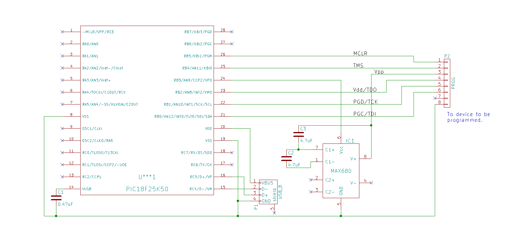

# Summary

This is the PIC18F25K50 firmware for Prog, a programmer for selected Microchip PIC16F, PIC18F and PIC32F microcomputers.
The programmer is a PIC18F25K50 with associated circuitry that connects to a PC over USB and to the PIC to be programmed.
It is controlled from the PC using the [Prog-Win](https://github.com/jhbe/prog-win) command line utility, which reads
[HEX files](https://en.wikipedia.org/wiki/Intel_HEX). Typically the HEX file would have been generated by one of the
(free) Microchip compilers.

    +----------------+       +-------------+        +------------------------------+
    | Windows PC     |       | Programmer  |--Vdd-->| PIC16/18/32 to be programmed |
    |                |       |             |--Gnd-->|                              |
    |  prog-win.exe <---USB->| PIC25K50    |<-PGD-->|                              |
    |                |       | MAX680      |--PGC-->|                              |
    +----------------+       +-------------+  etc.. +------------------------------+

Note that the picture above illustrates the Prog chicken-and-egg problem; without access to a preprogrammed PIC18F25K50 you
need the programmer to program the programmer PIC.

# Supported PICs

The following PICs have been tested:

* PIC16F:
    * PIC16F628A
    * PIC16F648A
* PIC18F:
    * PIC18F2450
    * PIC18F2550
    * PIC18F4550
    * PIC18F25K50
    * PIC18F1330
* PIC32MX
    * PIC32MX150F128
    * PIC32MX220F032
    * PIC32MX250F128

...but any device using any of the five programming specifications should work. The specifications are Microchip documents:

* PIC16: DS41196E "PIC16F6xx/A EEPROM Programming Specification". This firmware implements the high-voltage In-Circuit Serial Programming (ICSP) specification.
* PIC18: DS39622F "Flash Microcontroller Programming Specification", DS41630B (with the same title) and DS39752B (with the same title). This firmware implements the high-voltage In-Circuit Serial Programming (ICSP) specification.
* PIC32: DS66145J "PIC32MX Flash Programming Specification". This firmware implements the 4-wire JTAG interface (not the 2-wire In-Circuit Serial Programming (ICSP) specification).

The following devices are covered by the specs:

* PIC16F627A
* PIC16LF627A
* PIC16F628A
* PIC16LF628A
* PIC16F648A
* PIC16LF648A
* PIC18F1230
* PIC18F1330
* PIC18F2221
* PIC18F2321
* PIC18F2410
* PIC18F2420
* PIC18F2450
* PIC18F24K50
* PIC18LF24K50
* PIC18F2455
* PIC18F2480
* PIC18F2510
* PIC18F2515
* PIC18F2520
* PIC18F2525
* PIC18F2550
* PIC18F25K50
* PIC18LF25K50
* PIC18F2580
* PIC18F2585
* PIC18F2610
* PIC18F2620
* PIC18F26K50
* PIC18LF26K50
* PIC18F2680
* PIC18F4221
* PIC18F4321
* PIC18F4410
* PIC18F4420
* PIC18F4450
* PIC18F45K50
* PIC18F4455
* PIC18F4480
* PIC18F4510
* PIC18F4515
* PIC18F4520
* PIC18F4525
* PIC18F4550
* PIC18LF45K50
* PIC18F4580
* PIC18F4585
* PIC18F4610
* PIC18F4620
* PIC18F46K50
* PIC18LF46K50
* PIC18F4680
* All PIC32MX devices

# Build

This repo is configured for MPLAB-X v3.55 (the free IDE from Microchip) and XC v1.41 (a C compiler with a free option).
It uses the Microchip MCC v1.35.

# Pins

The pins to connect to the device to be programmed are (in addition to GND):

|  Pin   |  PIC16 and PIC18  |  PIC32  |
| ------ | ----------------- | ------- |
|  RB5   |                   |  MCLR   |
|  RB4   |                   |  TMS    |
|  RB3   |  Vpp              |         |
|  RB2   |  Vdd              |  TDO    |
|  RB1   |  PDG              |  TCK    |
|  RB0   |  PGC              |  TDI    |

# Circuit

The PIC18F25K50 connects to the PC over a USB cable. A MAX680 is used to pump
a 5V supply to the required Vpp 10V for PIC16 and PIC18. Only half of the MAX680
is used; there's no need for a -10V.

For pure PIC32 programming the MAX680 and associated circuitry can be omitted.

Various bypass caps are not shown below; see the PIC18F25K50 documentation.

# Driver

Windows 7 and up contain a generic USB driver sufficient for Prog. When the programmer
is connected to the Windows PC and a driver is asked for, nominate the "windows driver"
directory in this repo. This will trigger Windows to read the prog.inf file and using
the information within configure the Prog hardware as a generic USB device. Once
successful, the Prog-Win command line utility is used to work with the programmer.

# Limitations

There is currently no support for programming data EEPROM (read: semi-static RAM). There's no technical reason for why it could not be added, I just never needed it.

# Known Issues

Sometimes, and in particular with long (>100mm) leads between the programmer and the chip to be programmed, the verification step may fail. Another try often helps. Shorter leads does too.

# TODO

* Support for data EEPROM.

